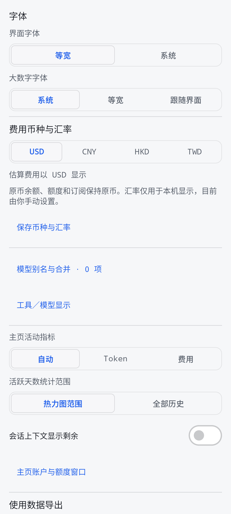
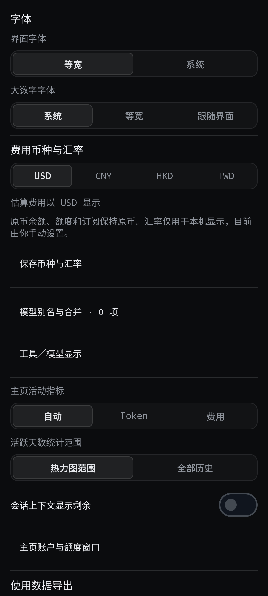

# Token Monitor Android · Hub 查看端

本项目基于 [The-Minion-oOo/token-monitor-android](https://github.com/The-Minion-oOo/token-monitor-android)，提供中文界面及本分支的显示与 Hub 兼容改进。感谢原作者做出了与桌面 Token Monitor 风格非常接近的安卓客户端。

**0.68 起，本分支直接跟进 [Javis603/token-monitor 桌面端](https://github.com/Javis603/token-monitor) 的功能与界面，不再等待安卓上游发布相同版本。** 这表示更新依据改变，代码仍保留安卓上游基础；并非完全重写或取消原作者贡献。0.67 及以前的版本沿安卓上游更新。

本分支版本：`v0.68.0-hub.2`，`versionCode 680102`。保持原应用 ID 和固定签名，可覆盖安装本分支旧版本。

[下载已发布 APK](https://github.com/Gott-mit-Uns/token-monitor-android/releases/latest) · [Hub 连接说明](HUB.md) · [构建说明](BUILDING.md) · [0.68 改进与差异](docs/reviews/desktop-068-current.md)

## 使用方式

手机只读取已有 Token Monitor Hub：支持 NAS／电脑 Hub、HTTPS 反代域名、Tailscale 和局域网。采集仍由各电脑或 NAS Agent 完成，安卓不会上传设备数据或修改共享订阅。

凭据采用 Keystore 支持的加密存储并排除备份。输入地址及凭据后验证连接；不要把凭据写入 URL。已有配对和缓存保持兼容。

前台启动读取一次统计并建立单条 SSE；断线采用重连和每 60 秒轮询后备。手动刷新重新读取相关数据；退到后台停止常规同步，保留离线缓存。若你主动开启小组件 Live，则每 60 秒读取一次，最多一小时，可随时停止；默认不创建周期后台任务。设备数据的新鲜度取决于采集设备上报，并不等于手机连接状态。

## 本分支的改进

- 中文界面、黑白主题工具与设备图标；内容图标 16／20／24dp，与文字大小独立设置。
- 主页万／亿或 K／M／B，二级页面完整 Token 整数；主页按本分支选择保留活动热力图、隐藏趋势模块。
- 设备名称直接跟随 Hub，取消安卓改名入口。旧本地别名偏好保留但不再覆盖 Hub。
- 缓存未命中包含写入，写入作为“其中缓存写入”展示；保留未分类 Token。
- 未定价 Token 和已知费用小计提示覆盖项目、历史、趋势与小组件；小组件用 `+ ?`／`— (?)` 标记费用不完整。Codex Dots 按工具、来源和覆盖字段共同识别。
- 独立界面／大数字字体角色；USD／CNY／HKD／TWD 手动汇率按币种保存，采用桌面端费用精度及符号。账户余额与订阅仍显示原币。
- 模型规范化别名与自动分组（关闭／重复名称／移除前缀）；仅改变本机显示，不修改 Hub。
- 工具、模型和重点账户置顶与排序；设置中支持长按手柄拖动及上移／下移。账户与额度窗口可以分别隐藏，不再固定截取前三个账户和前两个窗口。
- 会话上下文已用／剩余显示；有来源时展示模型 Token 拆分，不推断逐条对话内容。
- 实时速率使用计时计数的增量，支持速度／消耗切换，避免用累计平均值冒充实时速度。
- 订阅开始／结束／续费／充值／时长只读详情；支持提供方汇总的本月 API 等价费用与月均订阅费比较，无法可靠换算时不显示倍数。
- 用户主动导出 JSON、CSV 或 ZIP；ZIP 包含统计、每日工具、每日模型 CSV，使用 UTF-8 BOM。费用保持原始 USD，模型和工具保持 Hub 原始分类；排除凭据、会话标题、提示词与回复。
- 保留七个小组件入口及原有自适应布局。

## 主页示意

<table><tr>
<td width="50%"><b>浅色</b> </td>
<td width="50%"><b>深色</b> </td>
</tr></table>

主页图片由 0.68 实际组件使用合成数据与加长视口渲染；不是用户真实用量。普通手机可纵向滚动查看。

## 0.68 新增设置

<table><tr>
<td width="50%"><b>浅色</b> </td>
<td width="50%"><b>深色</b> </td>
</tr></table>

来自 Android 实际组件与合成数据，不包含地址或凭据。字体采用 Android 可用字体，不捆绑 macOS／Windows 的专有字体。

## 代码来源与许可

本项目继续大量使用安卓上游的基础实现。按同路径 Kotlin 生产代码的非空、非注释行比较，当前文本保留比例约 **77.5%**；该数字不是作者贡献或版权归属比例，资源与构建继承也不在其中。[核对方法与基准](docs/reviews/upstream-code-retention.md)。

保留安卓上游的 MIT 署名与许可；桌面端对齐逻辑和素材来源见 [第三方声明](THIRD_PARTY_NOTICES.md)。服务名称和标识属于各自权利人，展示不代表官方合作或认可。

## 验证边界

0.68 桌面源码的隔离 Hub 已验证认证读取和 SSE。模拟器验证与用户真实手机、启动器及已认证 NAS 联调分别记录，不能互相替代。Android 17 尚未验证。正式发布记录以 GitHub Release 及对应验证文件为准。
