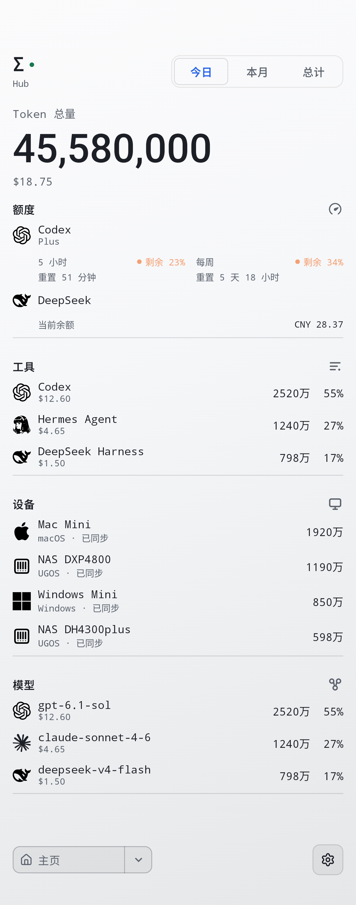
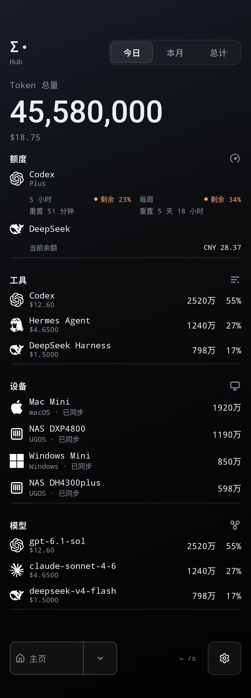
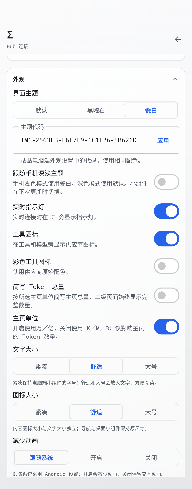
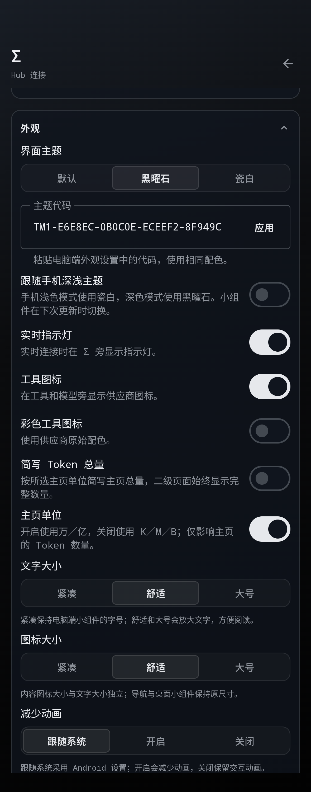
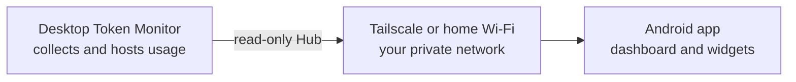

> **Token Monitor Android · 非官方独立 Hub 客户端 · v0.67.0-hub.3**
>
> 发布仓库：[Gott-mit-Uns/token-monitor-android](https://github.com/Gott-mit-Uns/token-monitor-android) · [下载安装包](https://github.com/Gott-mit-Uns/token-monitor-android/releases/latest)。
>
> 基于安卓上游 v0.67.0 r1，保留中文、设备别名、主题图标、独立图标尺寸及主页中文单位。支持 NAS／电脑 Hub、HTTPS 反代域名、Tailscale 和局域网。应用 ID 与签名保持不变，可覆盖安装旧 cf 版本；原作者自动 APK 更新保持关闭。
>
> hub.3 完成桌面端查看功能的三个阶段对齐：设备名称与缓存明细、币种与手动汇率、模型别名合并、行显示和数据导出，以及二级页面完整数字与图表点击。原币余额和订阅保持原币，安卓仍只读 Hub。
>
> 0.67 跟进 TM2 独立图表颜色、MiMo 分产品额度与原币费用，并验证会话标题共享及撤销。保留本分支全部自定义设置。
>
> 新增紧凑、横向、竖向、总览、详细五个小组件入口，保留自动适配与四页切换，共七个入口。网格大小由启动器决定，以实际 dp 空间适配。Pages 的四个页面通过左右点击切换。
>
> [Hub 连接说明](HUB.md) · [更新与验证](docs/releases/v0.67.0-hub.3.md)
>
## 本分支主页 · 浅色与深色

中文界面、主页万／亿单位、独立图标尺寸，以及按主题切换的黑白工具和设备标识。支持 NAS／电脑 Hub 与 HTTPS 反代域名；设备可设置安卓本地别名。

<table>
  <tr>
    <td align="center" valign="top" width="50%"><b>浅色 · Porcelain</b><br><br><a href="docs/images/fork-home-light.png"></a></td>
    <td align="center" valign="top" width="50%"><b>深色 · Obsidian</b><br><br><a href="docs/images/fork-home-dark.png"></a></td>
  </tr>
</table>

> 两张图由本分支的实际 Android 主页组件使用同一份合成数据渲染，为同时展示额度、工具、设备和模型采用加长视口；普通手机可纵向滚动查看。用量、费用、账户和设备均为示意数据，不包含真实 Hub 地址或凭据。
>
> 示例模型配置：Codex → `gpt-6.1-sol`；Hermes Agent → `claude-sonnet-4-6`；DeepSeek Harness → `deepseek-v4-flash`。这些是示例配置，实际可用模型与用量以 Hub 上报为准。

### 本分支设置 · 外观

图标大小与文字大小独立选择；主页单位开关控制万／亿或 K／M／B，仅影响主页。二级页面继续显示完整 Token 数量。图标可按主题使用黑白标识，也可开启品牌色。

<table>
  <tr>
    <td align="center" valign="top" width="50%"><b>浅色 · 外观设置</b><br><br><a href="docs/images/fork-settings-light.png"></a></td>
    <td align="center" valign="top" width="50%"><b>深色 · 外观设置</b><br><br><a href="docs/images/fork-settings-dark.png"></a></td>
  </tr>
</table>

> 截图来自实际 Android 设置页面，已展开“外观”并滚动到显示选项；图标尺寸提供紧凑 16dp、舒适 20dp、大号 24dp 三档。设备别名在设备详情中修改，不在外观设置中。

---

> 下方保留上游项目介绍与上游截图；原版发布渠道及验证记录不代表本分支验证结果。

<p align="center">
  
</p>

<h1 align="center">Token Monitor for Android</h1>

<p align="center"><b>Your desktop usage. In your pocket.</b><br>
Tokens, account limits, models and trends from the desktop Token Monitor Hub, plus home-screen widgets that stay useful with the app closed.</p>

<p align="center">
  <a href="docs/INSTALL.md">Build or install</a> ·
  <a href="docs/PAIRING.md">Pair with your desktop</a> ·
  <a href="docs/WIDGETS.md">Widgets</a> ·
  <a href="CHANGELOG.md">What changed</a>
</p>

<p align="center">
  <a href="https://github.com/Gott-mit-Uns/token-monitor-android/actions/workflows/android.yml"></a>
  
  
  
  <a href="LICENSE"></a>
</p>


Your desktop [Token Monitor](https://github.com/Javis603/token-monitor) already
tracks the usage. This app brings the same dashboard, visual language, and
numbers to your phone, with home-screen widgets for quick checks.

The desktop stays the collector and the source of truth. The phone reads its Hub over your own private network and shows what it finds. That is the whole trick.

## The desktop dashboard, made mobile

<table>
  <tr>
    <td align="center" valign="top" width="33%"><a href="docs/images/home.png"></a><br><sub><b>Command center</b><br>Totals, limits, tools, devices, models</sub></td>
    <td align="center" valign="top" width="33%"><a href="docs/images/filtered-models.png"></a><br><sub><b>Tap a tool</b><br>See the models behind it</sub></td>
    <td align="center" valign="top" width="33%"><a href="docs/images/trends.png"></a><br><sub><b>Find the busy days</b><br>Cards, heatmap, daily series</sub></td>
  </tr>
  <tr>
    <td align="center" valign="top" width="33%"><a href="docs/images/devices.png"></a><br><sub><b>Every desktop</b><br>What each machine contributes</sub></td>
    <td align="center" valign="top" width="33%"><a href="docs/images/projects.png"></a><br><sub><b>Projects and sessions</b><br>Searchable, without transcripts</sub></td>
    <td align="center" valign="top" width="33%"><a href="docs/images/settings.png"></a><br><sub><b>Make it yours</b><br>Themes, text size, motion, views</sub></td>
  </tr>
</table>

> Every image is a capture of the Android app using made-up accounts, devices,
> projects, and usage. Capture instructions are in the [development guide](docs/DEVELOPMENT.md#showcase-captures).

## One fixed card, four focused pages

<a href="docs/images/widget-pages-gallery.png"></a>

**Token Monitor · Pages** is the redesigned widget shown above. It requests a
wide 4×2 placement and always draws the same 1.82:1 composition. Android launchers
can allocate different physical dimensions, and some may still show resize handles,
but the Pages widget does not reflow, add rows, or switch layouts.

- **Overview** keeps the complete token total, cost, recent activity, streak, tool
  share, and week summary together.
- **Limits** shows the four tightest reported account windows with their reset or
  expiry wording.
- **Breakdown** compares up to three tools and three models on one shared row rhythm.
- **Activity** pairs the labeled seven-day chart with a thirteen-week heatmap and
  recent activity totals.

Tap the left or right edge to change pages. The selected page and four position
dots update locally without waking the Hub or starting background work. Refresh
performs one bounded fetch; Live checks current stats every 30 seconds for up to
one hour and can be stopped from the widget or its notification. When the Hub is
offline, the last snapshot remains visible with a `SAVED` status.

The widget picker also includes the original **Token Monitor · Usage** widget. It
is a separate responsive provider that reflows a single summary as its launcher
allocation changes; its layouts are not alternate sizes of the four Pages shown
above. Both widgets follow the app theme, including desktop `TM1-…` theme codes.
The v0.67.0 release also accepts `TM2-…` codes with an independent chart color.

[Widget behavior and controls](docs/WIDGETS.md) · [Widget design notes](docs/WIDGET_DESIGN.md).

## How it works



The phone talks to the Hub the desktop already runs. It reads five documented
endpoints and one live stream over Tailscale, or home Wi-Fi when enabled. There
is no public server, vendor relay, or separate Token Monitor account.

## What it shows

- Live totals while the app is open, an immediate refresh on return, pull-to-refresh, and a saved snapshot when the Hub is unavailable.
- Day, week, month, rolling 7, 30 and 90 days, one year, all history and total.
- Account limits with the desktop's reset countdowns.
- Tools, devices, models, projects, sessions, subscriptions, service status, activity and trends, each with an `updated 5m ago` freshness.
- Recent and running sessions on Home, reported conversation titles, and context-window use when the desktop provides them, without reading prompt or response bodies.
- Trends by tool or model, shown as bars or a K-line chart.
- Cache hit, cache miss, output and unclassified token details where the Hub provides them.
- The desktop's Default, Obsidian and Porcelain themes, theme codes pasted as-is, an option to follow the phone's light and dark setting, three text sizes, motion controls, and reorderable views and Home modules.
- A Back button that goes Home instead of quitting on you, and a light haptic tick on every tab.

The Hub does not carry prompt or response bodies. It can carry a conversation title, which may contain sensitive text; the phone shows it in Home and Sessions, never on a widget. Turn off **Show session titles** in Settings to hide them on the phone; this does not remove them from the local snapshot cache.

Home shows the five most recent sessions plus any other running sessions. On an existing installation, enable **Sessions** under **Settings → Main dashboard → Home modules**; saved layouts are not reset.
Session rows also show generation speed, cache-hit percentage and prompt-cache estimates when the Hub supplies them. Speed is a session average, not a live rate; cache retention is an estimate, not a guarantee.

## Private and light

- Read-only. The app cannot change desktop settings, usage data, or files.
- Hub credentials live in an Android Keystore-backed store and are excluded from backups.
- No ads, analytics, wake lock, scheduled background work or "please rate us" popup.
- App updates checks published GitHub releases from Settings and verifies a downloaded signed APK before Android asks to install it; there is no background update check or silent install.
- The visible dashboard streams immediately. Widget Live uses a lightweight 30-second stats refresh and stops after one hour.
- Android 13 and newer asks for notification permission the first time you start a widget session, so the Stop control has somewhere to live. Ordinary use needs no permission prompts at all.

[Privacy and security](docs/SECURITY.md) · [Report a concern](SECURITY.md).

## Get connected

You need Android 8.0 or newer and a desktop running Token Monitor with Hub hosting on. Android upstream v0.67.0 r1 is fixture-verified against desktop v0.67.0. A physical-phone upgrade has not yet been checked for this release.

1. Follow [Installing and updating](docs/INSTALL.md) to get the signed fork APK from this repository’s Releases.
2. Put [Tailscale](https://tailscale.com/) on the desktop and the phone, signed into the same tailnet.
3. In desktop Token Monitor, open **Settings → Multi-device Sync → Host Hub** and copy the address and shared secret.
4. In the app, type the address that starts with `100.`, paste the secret, tap **Connect**. Just the numbers are enough.
5. At home, tap **Find** and the app fills in the desktop's Wi-Fi address as a fallback. From then on the phone uses whichever route answers.

Desktop v0.64's optional iCloud Drive sync does not replace the Hub connection for Android.

[Pairing and troubleshooting](docs/PAIRING.md) · [Installing and updating](docs/INSTALL.md).

## Compatibility

| | |
| --- | --- |
| Current public release | [`v0.67.0-r1`](https://github.com/The-Minion-oOo/token-monitor-android/releases/tag/android-v0.67.0-r1) |
| Latest phone-verified build | signed `v0.62.0-r1` over v0.61.0 r1; saved connection and placed Pages widget registration preserved |
| v0.67.0 phone checks | In-place upgrade, saved pairing, widget retention, and battery behavior await owner verification |
| Desktop baseline | Token Monitor `v0.67.0` |
| Upstream commit | [`338a965`](https://github.com/Javis603/token-monitor/commit/338a965f6c9a5a06b017eba4ebd7d5997973519e) |

The visible version matches the desktop release the phone understands. Android-only
builds bump the release revision and internal version code while the compatibility
line stays on its verified desktop version. When desktop Token Monitor moves past that, the phone
continues using the verified endpoints until a follow-up Android release checks
the new protocol. Details are in [`upstream.json`](upstream.json) and
[`RELEASING.md`](docs/RELEASING.md).

## Build and contribute

JDK 17 or newer, Android SDK 37 and the bundled Gradle wrapper:

```powershell
.\gradlew.bat :app:testDebugUnitTest :app:lintDebug :app:assembleDebug
```

Add `-PtokenMonitorPreview=true` to install a separate `.preview` build next to the release without touching its pairing. [Development guide](docs/DEVELOPMENT.md) · [Contributing](CONTRIBUTING.md).

## Documentation

| Using it | Understanding it | Maintaining it |
| --- | --- | --- |
| [Installation](docs/INSTALL.md) | [Architecture](docs/ARCHITECTURE.md) | [Development](docs/DEVELOPMENT.md) |
| [Pairing](docs/PAIRING.md) | [Hub protocol](docs/PROTOCOL.md) | [Validation](docs/VALIDATION.md) |
| [Widgets](docs/WIDGETS.md) | [Desktop parity](docs/DESKTOP_PARITY.md) | [Releasing](docs/RELEASING.md) |
| [Privacy](docs/SECURITY.md) | [Widget design](docs/WIDGET_DESIGN.md) | [Following upstream](docs/UPSTREAM_SYNC.md) |

This project is independent of the upstream Token Monitor maintainers and of the services whose marks appear in the app. [MIT License](LICENSE) · [Third-party notices](THIRD_PARTY_NOTICES.md).

<p align="center">
  Made with ❤️ by <a href="https://github.com/The-Minion-oOo"><b>The_Minion_oOo</b></a><br>
  <sub>...: Thanks to Codex and Claude :...</sub>
</p>
