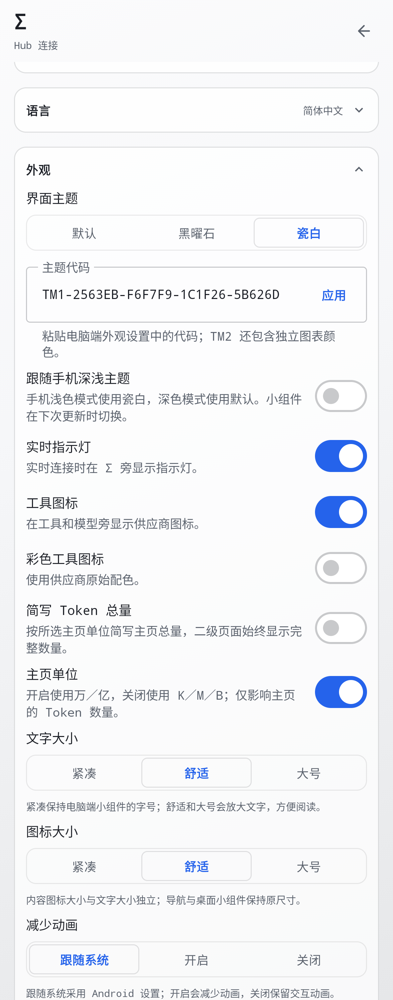
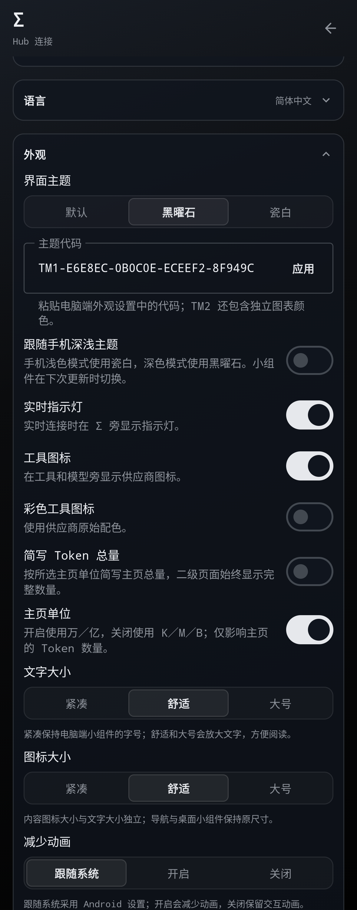

# Token Monitor Android · 中文 Hub 查看端

基于 [The-Minion-oOo/token-monitor-android](https://github.com/The-Minion-oOo/token-monitor-android) 的安卓客户端，保留中文与个人显示改进。感谢原作者实现了与桌面 Token Monitor 风格接近的轻量查看界面。

**当前版本 `v0.68.0-hub.5`，versionCode `680105`。** 功能基础仍为本分支 **0.67 hub.2** 加安卓上游 **0.68.0 r1**；本版优化启动图标和设备显示，继续暂停直接复刻桌面扩展。应用ID和固定签名不变，可覆盖之前的hub版本，无需卸载。

[下载 APK](https://github.com/Gott-mit-Uns/token-monitor-android/releases/latest) · [安装说明](docs/INSTALL.md) · [Hub连接](HUB.md) · [更新维护](docs/UPSTREAM_SYNC.md) · [构建说明](BUILDING.md)

## 保留的改进

- 简体中文、英语和跟随系统；主页“活动”等文字已翻译。
- DeepSeek Harness、Hermes Agent、Codex等工具与模型图标；NAS、Windows、Mac使用已确认的黑白设备图标。
- 内容图标16／20／24dp，与文字大小独立设置。
- 主页万／亿或K／M／B切换；“简写Token总量”独立控制主页顶部。二级Token显示完整整数。
- 主页不显示趋势，保留独立趋势页；保留设备二级页的紧凑对齐与大字体适配。
- 主页设备按当前周期Token用量降序排列，隐藏零用量；设备二级页保留完整设备列表，常规字体下用两行展示名称／系统、同步状态／时间和Token／费用。
- 启动图标采用独立的蓝色背景和Σ矢量前景，去除深色外圈与重复圆角留白；支持系统主题图标。HyperOS3真机启动器效果仍待确认。
- 设备名称跟随Hub，不重新在手机改名。旧安卓别名记录不再影响显示。
- NAS／电脑Hub支持HTTPS反代域名、Tailscale和局域网。安卓只读，不采集、不上传设备、不编辑共享数据。
- 凭据采用Keystore支持的加密存储并排除备份；离线保留最后有效快照。
- 保留上游七个小组件入口、尺寸适配和限时Live。

## 跟随安卓上游0.68

采用未定价Token、已知费用小计和Codex Dots观测范围提示，包括项目、历史和小组件。旧Hub缺少新字段时保持原显示；正常零费用不会推断为未定价。原币余额和订阅保持原币，估算费用使用USD。

本版撤下：费用换算与手动汇率、模型别名／自动合并、逐项隐藏工具与模型、条目置顶拖动、独立字体选择、主页额度窗口配置、额外活动指标与上下文开关、汇总实时速率、扩展订阅比较和JSON／CSV／ZIP导出。旧桌面扩展设置不再读取，凭据、快照和原有显示设置保留。

前台读取一次统计并保持单条SSE；断线重连并每60秒轮询后备。退出前台停止常规同步。主动开启小组件Live时每60秒读取，最多一小时；默认不创建周期后台任务。同步频率未因本次恢复改变。

## 界面示意

<table><tr><td width="50%">浅色主页 </td><td width="50%">深色主页 </td></tr></table>

<table><tr><td width="50%">浅色外观设置 </td><td width="50%">深色外观设置 </td></tr></table>

截图由安卓实际组件使用合成数据渲染，不含真实地址、凭据或用量。主页示意使用加长视口，普通手机可滚动查看；示例DH4300plus今日用量为零，因此不在主页显示。

[两行设备页预览](docs/images/hub5/devices-after-dark.png) · [启动图标48／64dp预览](docs/images/hub5/launcher-icon.png)

## 版本与来源

当前安卓来源为 `android-v0.68.0-r1`；Hub协议验证使用桌面0.68固定源码。来源分别记录在 `upstream.json`。后续只跟进安卓稳定发布；桌面版本变化不触发逐项复刻。

[功能恢复范围](docs/reviews/hub4-rollback.md) · [本版发布说明](docs/releases/v0.68.0-hub.5.md)。旧Release保留。真机／启动器、已认证NASHub、Android17未验证；验证范围和校验值随Release提供。

本项目继续大量使用安卓上游代码，保留原作者署名及MIT许可。第三方标识的来源见 [许可与素材说明](THIRD_PARTY_NOTICES.md)。
