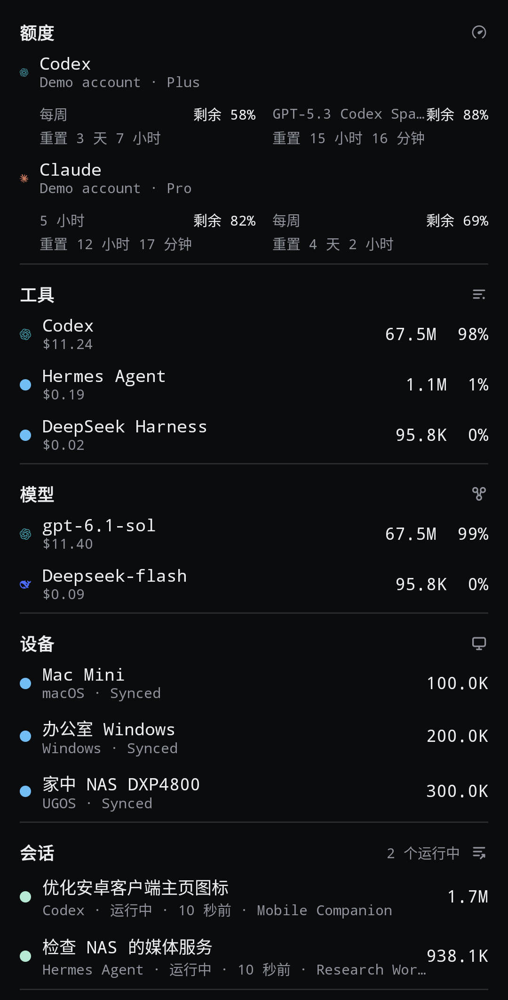
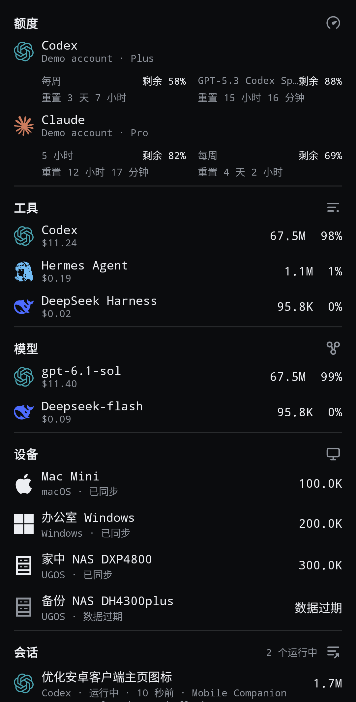

# Token Monitor Android v0.65.0-cf.3

主页图标统一放大，修复 DeepSeek Harness／Hermes Agent、会话及设备行只显示圆点的问题。沿用原签名，支持直接覆盖安装 cf.2；旧 Release 保留。

## 变化

- 额度、工具、模型、会话和设备内容图标统一为 20dp，模块导航图标为 18dp；文字间距与辅助行缩进统一。
- 补齐 DeepSeek Harness（含 dsh 等别名）与 Hermes Agent 官方标识。未知工具／模型在开启图标时使用通用标识；品牌色与图标开关设置保留。
- 会话使用第一个非空模型的图标；多模型名称单独换行显示，没有模型时显示工具标识，不将模型列表顺序解释为当前正在使用的模型。
- Windows／Mac 使用系统单色标识，Linux／NAS 使用统一黑白服务器图标。设备改名不影响图标，首页显示全部设备，包含零用量和离线设备。
- 设备同步／过期状态继续使用现有中文资源。

本轮不改变同步频率、统计口径、Hub、凭据加密、缓存或设备别名。

## 验证

130 项 JVM 测试通过；Android 12 与 Android 16 各 62 项设备测试通过。最终界面调整后各补跑 15 项相关截图测试。Lint 无错误，101 项警告；同签名覆盖安装及启动通过。

截图使用同一份合成数据，覆盖 360dp 宽、深浅主题、品牌色／单色与 1.0／1.5／2.0 字体比例。真实手机、已认证 Cloudflare Hub 及 Android 17 尚未验证。

## 截图

| cf.2 对照 | cf.3 深色 |
| --- | --- |
|  |  |

[浅色截图](../images/cf3/home-after-light.png) · [设备与会话截图](../images/cf3/home-devices-sessions.png) · [完整验证记录](../validation-cloudflare.md)

## 安装

下载 `token-monitor-minion-cloudflare-v0.65.0-cf.3.apk` 并直接覆盖安装当前兼容版。应用 ID 为 `io.github.theminionooo.tokenmonitor.cloudflare`，versionCode 为 650103。不要卸载旧版，以保留连接与本地设置。

附件提供 APK、对应源码、改版前后截图及 SHA256SUMS；签名私钥和口令不包含在交付文件中。
