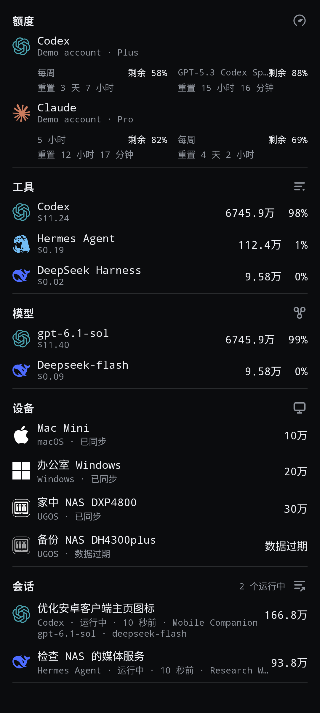

# Token Monitor Minion CF v0.65.0-cf.4

独立控制图标大小，主页默认使用万／亿，二级页面显示完整 Token 整数，并更换主题适配设备标识。沿用原签名，可直接覆盖安装 cf.3；旧 Release 保留。

## 变化

- 设置 → 外观 → 图标大小：紧凑 16dp、舒适 20dp、大号 24dp，默认舒适。与文字大小独立，覆盖主页和二级页面内容标识，辅助行缩进同步调整。导航、标题、状态圆点和小组件尺寸不变。
- 简写 Token 总量下新增主页单位，默认开启，独立于界面语言。开启使用万／亿，关闭沿用 K／M／B；中文格式按桌面端精度取整并处理单位进位。顶部总量关闭简写时显示完整整数，其余主页 Token 摘要按单位选项显示。
- 工具、模型、设备、项目、会话与趋势二级页面的 Token 总量、明细、图表刻度及提示均显示千位分隔完整整数。费用、消息数、余额、时间及百分比保持原格式。
- 使用用户指定的六份本地 SVG 转换资源：Linux 默认绿联 NAS，Windows 与 Mac 根据平台识别，浅色／深色主题选择对应原色标识。设备别名不改变图标，过期设备降低透明度。来源、摘要及许可见 THIRD_PARTY_NOTICES.md。

不改变 Hub 协议、同步频率、凭据、缓存、小组件或统计结果。

## 验证

136 项 JVM 测试通过；Android 12 与 Android 16 各 75 项设备测试通过。覆盖九种文字／图标组合、16／20／24dp 实际尺寸、旧偏好默认值、持久化、主页与二级数字范围隔离。360dp 宽合成截图覆盖深浅主题、品牌色及 1.0／1.5／2.0 字体比例；长名称沿用摘要省略，Token 数字保持可读。

同签名覆盖安装与启动、Lint 和最终构建记录见[验证记录](../validation-cloudflare.md)。真实手机、用户已认证 Cloudflare Hub 与 Android 17 未验证。截图均为合成数据。

## 截图

| cf.3 对照 | cf.4 深色 |
| --- | --- |
|  |  |

[浅色设备标识](../images/cf4/home-light.png) · [主页单位](../images/cf4/appearance-units.png) · [独立图标大小](../images/cf4/appearance-icons.png) · [完整 Token 明细](../images/cf4/models-full.png) · [设备页](../images/cf4/devices.png)

## 安装

下载 `token-monitor-minion-cloudflare-v0.65.0-cf.4.apk`，直接覆盖安装，保留连接和偏好。应用 ID 为 `io.github.theminionooo.tokenmonitor.cloudflare`，versionCode 为 650104。附件包含 APK、源码 ZIP、截图 ZIP 和 SHA256SUMS；不包含签名私钥或凭据。
