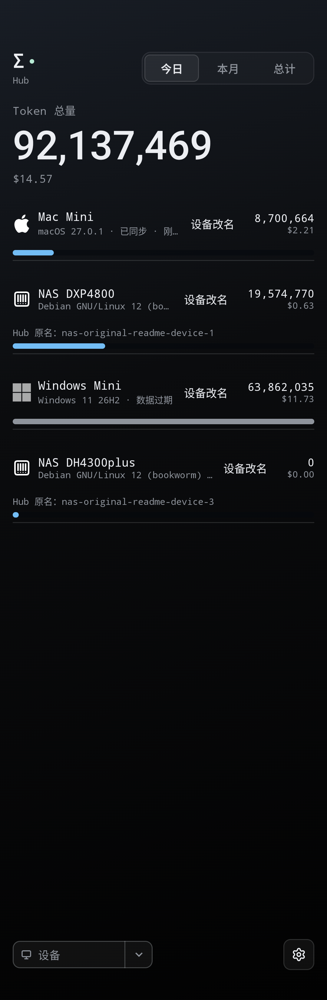
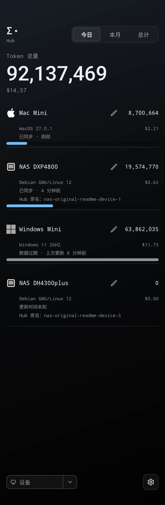
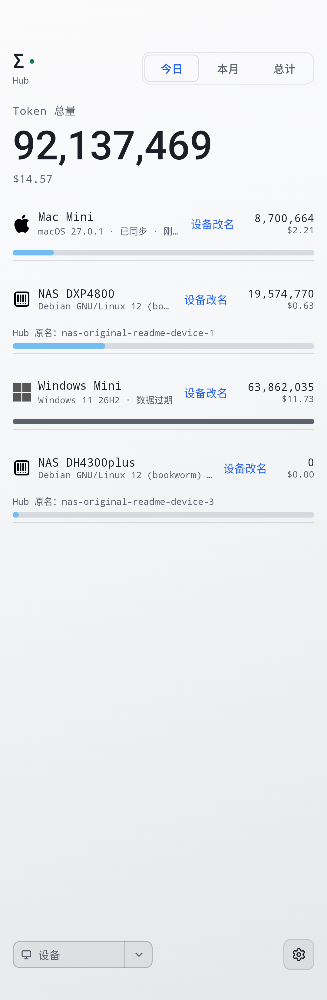
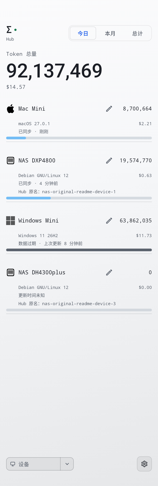

# v0.67.0-hub.2 · 设备页面对齐优化

## 改动

- 名称旁使用铅笔改名按钮（18dp 图标、48dp 点击区域），保留保存、取消与恢复 Hub 原名。
- 名称、系统、同步时间及 Hub 原名统一左边界，完整 Token 与费用统一右边界。
- 同步状态与时间独立成行，长系统名称不再挤掉更新时间；缺失时间明确显示“更新时间未知”。
- Debian 列表隐藏括号中的发行代号，展开后保留完整系统信息。
- 窄屏、大字体或数值占用较多空间时，统计移到独立右对齐行；不缩写 Token，不拆散数字；仅当极长完整数字超出单行宽度时缩放该数字，常规数值字号不变。
- 零用量设备显示空进度条，保留设备与完整零值。

仅改变设备二级页面；主页、Hub 协议、同步频率和别名存储不变。继续使用 0.67 桌面兼容基线，尚未跟进桌面 0.68。

## 同一份合成数据对比

截图为 360dp 宽、舒适图标、正常字体比例；数据与账户均为示例，不包含真实连接信息。

<table><tr><td width="50%">深色：修改前 </td><td width="50%">深色：修改后 </td></tr><tr><td>浅色：修改前 </td><td>浅色：修改后 </td></tr></table>

## 安装与验证

应用 ID、固定签名保持不变，versionCode 670102，直接覆盖旧版，无需卸载。

181 项单元与协议测试通过，无跳过。Android 12 和 Android 16 检查九种字体比例（1.0／1.5／2.0）与图标尺寸（16／20／24dp）组合、浅深主题、长中文别名、零用量、过期、未知更新时间及改名行为。Android 12 与 Android 16 各 17 项设备布局与别名测试通过，包括零用量设备的完整系统展开，以及极长整数的大字体显示。正式 APK 签名与上一版一致，Android 16 从 v0.67.0-hub.1 覆盖安装并冷启动成功；真实凭据迁移未验证。Lint 0 错误，121 警告、2 提示；新增两项为依赖版本可更新提示，没有新增设备布局警告。

真实手机、已认证 NAS Hub、Android 17 未验证；没有修改 NAS 服务。
