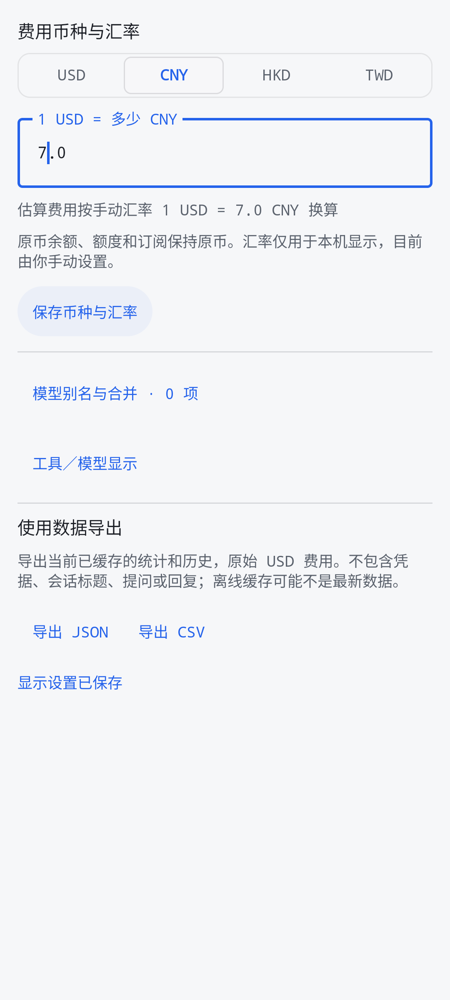
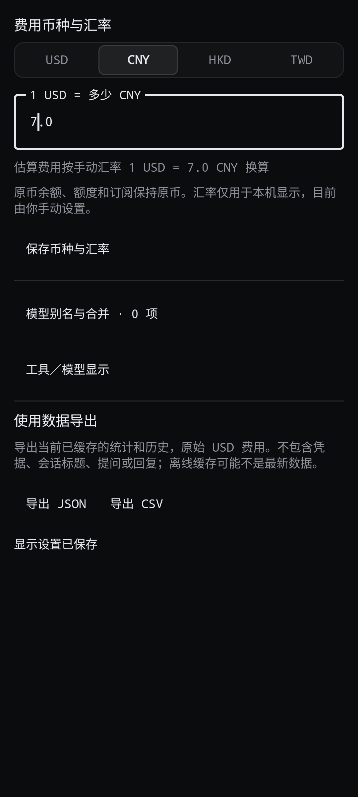
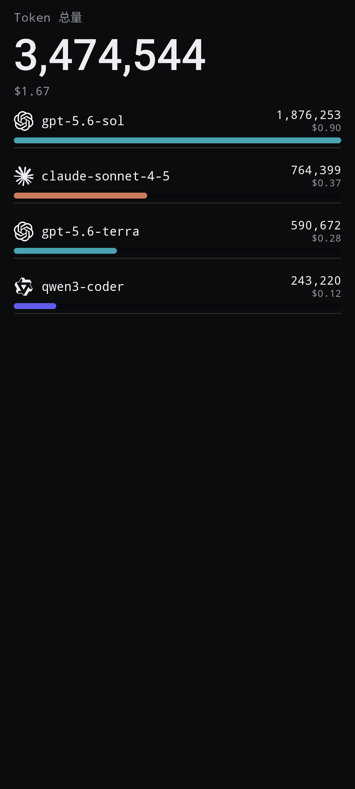
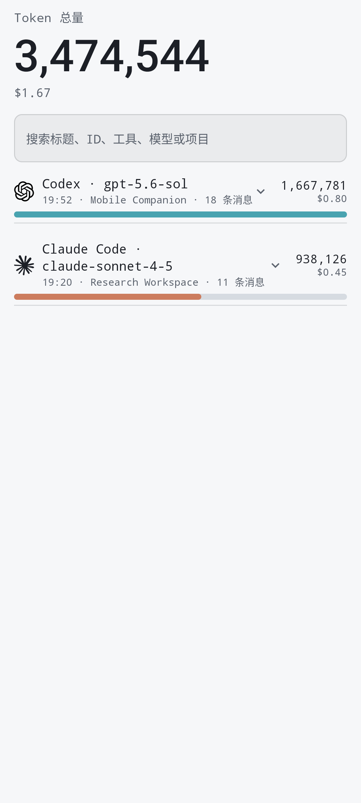
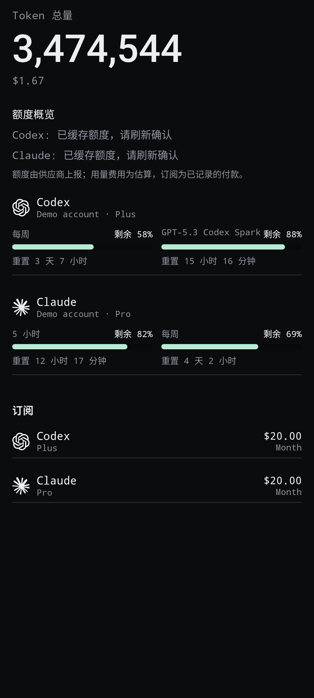
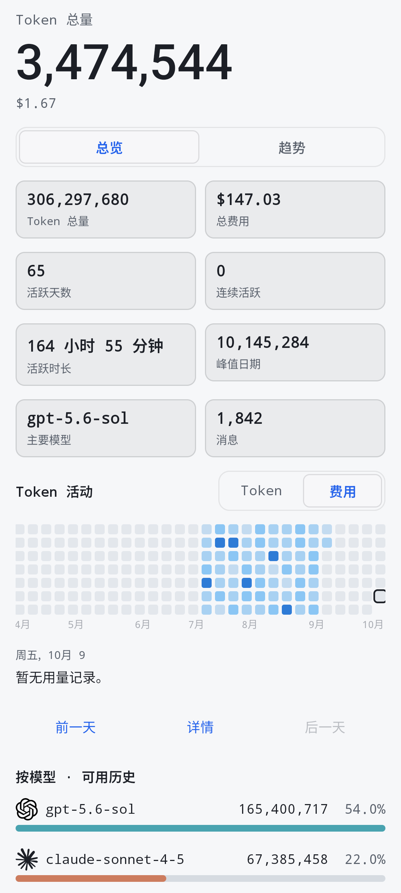

# v0.67.0-hub.3：桌面端查看功能对齐

在当前安卓 fork 上完成三个阶段：数据呈现对齐、显示功能补齐、二级页面适配。仍是只读 Hub 查看端；安卓上游基线保持 v0.67.0 r1，不包含电脑采集器或 Electron 窗口功能。

## 第一阶段：数据呈现

- 默认设备名称与桌面端一致：设备 ID → 主机名 → 通用名称。原有安卓本地别名继续优先，恢复原名后跟随 Hub 的设备 ID。
- 工具与模型单独显示缓存读取、未命中输入、缓存写入、输出与未分类，保持组件数量守恒。
- 会话展开信息增加输入、输出、缓存读取和缓存写入（仅有来源时显示）；会话图标按第一个非空模型选择。
- 隐藏工具／模型不改变总量、费用、设备、历史或导出。主页占比仍以全部 Token 为分母。

## 第二阶段：本机显示功能

设置 → 桌面端显示功能：

- USD、CNY、HKD、TWD 估算费用与手动汇率。显示当前汇率；原币余额、额度和订阅不转换。没有自动汇率服务。
- 模型别名与合并：选择已同步模型或手动输入，每行一个来源；多个来源可归入一个目标。移除映射即可恢复。总量、费用、工具下模型、缓存分类、会话模型和历史模型同步合并；不改写缓存或 Hub 数据。
- 选择工具／模型是否在主页及对应列表显示。暂时消失的隐藏项保留在设置中，可恢复。
- JSON／CSV 导出缓存中的总览、工具、模型、项目 ID、设备 ID 与汇总历史。使用原始 USD 费用；包括缓存时间与 JSON 新鲜度标记。模型分类使用当前安卓别名分组。排除连接地址、凭据、会话标题和对话正文。CSV 对公式前缀转义。

设置内容截图（合成数据）

| 浅色 | 深色 |
|---|---|
|  |  |

截图展示生产设置内容组件，未包含应用导航栏；汇率是合成示例，不代表实时汇率。

## 第三阶段：二级页面

- 工具、模型、项目、会话及共用明细采用统一的名称／统计布局。数字能放下时右对齐；大字体或宽度不足时进入独立统计行。
- 二级顶部 Token 总量保持完整整数，避免拆散数字。极端长度超出可用宽度时仅适配该数值的显示字号。
- 工具／模型增加最近 7 个已记录日的分类历史。工具筛选后的模型页不显示无法证明属于该工具的全局模型历史。
- 额度元信息允许换行；大字体采用单列窗口，保留完整重置提示，未知金额不伪装为可用额度。
- 趋势柱状图和 K 线支持点击日期查看完整 Token 与费用；K 线显示所在记录段首末／最高／最低值。缺失日期明确提示未知。
- 项目与会话搜索提示补齐中文。主页结构、主页不显示趋势、图标、主题、单位和同步频率保留。

| 模型 | 会话 | 额度 | 趋势 |
|---|---|---|---|
|  |  |  |  |

以上是实际 Android 页面内容组件使用合成快照的截图，不包含真实地址或凭据。

## 验证与边界

- 单元／协议测试：189 项通过，无失败、错误或跳过；包含别名统计守恒、隐藏行隔离、汇率、导出隐私及 CSV 转义、缓存组件边界。
- Android 12 39 项、Android 16 48 项相关设备测试通过（Android 16 额外包含小组件控制／主题／尺寸测试）。验证设置、保存、改名恢复、完整数字、图表点击、工具详情与模型导航隔离；覆盖 360dp、深浅主题、2.0 大字体，设备页覆盖 1.0／1.5／2.0 字体与 16／20／24dp 图标。
- 固定应用 ID `io.github.theminionooo.tokenmonitor.cloudflare`，固定签名；版本号 670103，支持覆盖旧版本。
- 没有修改 NAS 容器、Hub 接口、凭据或同步频率。小组件结构保留，估算费用跟随本地币种，模型分类跟随别名。
- 未进行真实手机、已认证 NAS Hub 与 Android 17 验收。不能仅凭模拟器结果宣称已通过真实日常使用验收。
- 对话正文、电脑账户切换、本机采集、桌面托盘／侧边栏仍由电脑端负责。会话平均速度不冒充实时 Token 速度。
